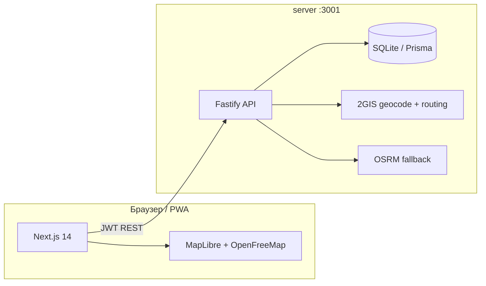

# NORA — Navigation Organized Route Assistant

Адаптивный городской помощник для Бишкека и окрестностей: интерактивная карта, подбор мест и пешеходных маршрутов с учётом настроения, бюджета, MBTI, возраста и района. Есть социальный слой (поиск людей, друзья, чат), партнёрские заведения и ментальный паспорт.

Фронтенд — **Next.js 14** (PWA). Бэкенд — **Fastify + Prisma** (отдельный процесс). Карта рендерится на **MapLibre GL** (тайлы OpenFreeMap / CARTO); геокодинг и пешеходная геометрия маршрутов — через **2GIS API** на сервере (с запасным **OSRM**).

---

## Возможности

| Область | Что умеет |
|--------|-----------|
| **Карта** | Векторная карта, светлая/тёмная тема, 3D-здания, геолокация с аватаром, центрирование на пользователе |
| **Маршрут на день** | Вайб (спокойный, романтичный, социальный…), время суток, бюджет, район, число остановок, MBTI |
| **Линия маршрута** | От вашей геопозиции → первая остановка → … → конец; по дорогам (2GIS/OSRM), не «по прямой» |
| **Навигация** | Кнопка «В путь»: вид от 3-го лица, камера следует за вами; карточку маршрута можно свернуть |
| **Фильтры** | Возраст (без баров/18+ для несовершеннолетних), несовместимые с вайбом места (коворкинги в «романтичном» и т.д.) |
| **Планер** | Рекомендации по настроению, сохранённые маршруты, отзывы и лайки мест |
| **Профиль** | Паспорт, MBTI, дата рождения, бюджет, страна/город, аватар |
| **Социальное** | Поиск людей, заявки в друзья, чат (с API — на сервере; без API — демо в `localStorage`) |
| **Локализация** | `ru`, `en`, `ky`, `ko` |

---

## Архитектура



Без `NEXT_PUBLIC_API_URL` фронт работает в **офлайн-демо**: данные профиля, друзья и часть настроек — в `localStorage`; маршруты и координаты мест — из встроенных каталогов.

---

## Требования

- **Node.js** 20+
- **npm** 9+
- Для полноценных маршрутов и координат мест — ключ [2GIS Platform](https://platform.2gis.ru/) (`DGIS_API_KEY` в `server/.env`)
- Геолокация в браузере — **HTTPS** или `http://localhost` (иначе API недоступен)

---

## Быстрый старт

### 1. Клонирование и зависимости

```bash
git clone https://github.com/Ayaopakana/NORA.git
cd NORA
npm install
cd server && npm install && cd ..
```

### 2. Бэкенд

```bash
cd server
cp .env.example .env
# Отредактируйте JWT_SECRET и при необходимости DGIS_API_KEY
npm run db:push
npm run dev
```

API: [http://localhost:3001](http://localhost:3001)  
Проверка: `curl http://localhost:3001/health`

### 3. Фронтенд

В корне создайте `.env.local` (см. `.env.example`):

```env
NEXT_PUBLIC_API_URL=http://localhost:3001
```

```bash
# из корня репозитория
npm run dev
```

Приложение: [http://localhost:3000](http://localhost:3000)

### 4. Координаты мест (один раз, с ключом 2GIS)

```bash
cd server
npm run geocode:places
```

Скрипт заполняет `server/data/place-coords.json` (~1 запрос/с с паузой). Без ключа используются запасные координаты и прямые отрезки между точками.

### Два терминала (удобно)

| Терминал | Команда |
|----------|---------|
| 1 | `npm run dev:api` |
| 2 | `npm run dev` |

---

## Переменные окружения

### Фронт (`.env.local`)

| Переменная | Обязательно | Описание |
|------------|-------------|----------|
| `NEXT_PUBLIC_API_URL` | Нет* | URL API, например `http://localhost:3001`. Без неё — режим демо без сервера |

\*Для регистрации, синхронизации профиля, друзей, чата и серверных маршрутов — **нужен**.

### Сервер (`server/.env`)

| Переменная | По умолчанию | Описание |
|------------|--------------|----------|
| `DATABASE_URL` | `file:./dev.db` | SQLite в `server/prisma/`. Для Postgres смените `provider` в `schema.prisma` |
| `PORT` | `3001` | Порт API |
| `JWT_SECRET` | — | Секрет для JWT (обязательно сменить в production) |
| `CORS_ORIGINS` | `http://localhost:3000` | Разрешённые origin через запятую |
| `DGIS_API_KEY` | пусто | Геокодинг каталога и пешеходные маршруты 2GIS |

Подробнее по эндпоинтам: [server/README.md](./server/README.md).

---

## Скрипты

### Корень (фронт)

| Команда | Назначение |
|---------|------------|
| `npm run dev` | Next.js в режиме разработки (:3000) |
| `npm run dev:clean` | Сброс `.next` и запуск dev |
| `npm run dev:api` | Запуск только бэкенда из корня |
| `npm run build` | Production-сборка |
| `npm run start` | Запуск собранного Next.js |
| `npm run lint` | ESLint |

### `server/`

| Команда | Назначение |
|---------|------------|
| `npm run dev` | API с hot-reload (`tsx watch`) |
| `npm run build` / `npm start` | Сборка и production-запуск |
| `npm run db:push` | Применить схему Prisma к БД |
| `npm run db:studio` | Prisma Studio |
| `npm run geocode:places` | Геокодировать каталог мест (2GIS) |
| `npm run geocode:places:force` | Перегеокодировать все id |
| `npm run coords:fix` | Ручные правки координат из скрипта |

---

## Структура репозитория

```
NORA/
├── public/                 # PWA manifest, иконки, service worker
├── server/                 # Fastify API, Prisma, каталоги мест, 2GIS/OSRM
│   ├── prisma/             # Схема БД (User, маршруты, соц., отзывы)
│   ├── data/               # place-coords.json (кэш геокодинга)
│   └── src/routes/         # auth, users, map, routes, social, places
├── src/
│   ├── app/                # Next.js App Router
│   │   ├── (map)/          # Карта, планер, чат, поиск, настройки, FAQ
│   │   ├── login/          # Вход
│   │   └── register/       # Регистрация (3 шага)
│   ├── api/                # Клиент REST к бэкенду
│   ├── components/         # UI, карта, планер, профиль
│   ├── contexts/           # Auth, локаль, тема
│   ├── hooks/              # Геолокация, геометрия маршрута на карте
│   ├── i18n/               # ru / en / ky / ko
│   └── lib/                # Логика маршрутов, карты, возраст, каталоги
├── .env.example
└── package.json
```

### Ключевые модули фронта

| Путь | Назначение |
|------|------------|
| `src/app/(map)/MapHubClient.tsx` | Главный экран карты, маршрут, навигация |
| `src/lib/build-day-route.ts` | Сборка маршрута на день |
| `src/lib/route-criteria.ts` | Скоринг мест по вайбу, времени, MBTI |
| `src/lib/route-venue-fit.ts` | Исключение баров, коворкингов и т.п. |
| `src/hooks/useMapRoutePath.ts` | Линия маршрута: API → OSRM → fallback |
| `src/hooks/useUserGeolocation.ts` | Трекинг GPS, режим навигации |
| `src/components/map/DayRouteCard.tsx` | Карточка маршрута (сворачивание, «В путь») |

---

## Карта и маршруты

1. **Отображение** — MapLibre, стили под светлую/тёмную тему (`src/lib/map-nora-vector-style.ts`).
2. **Старт** — вид сверху на геопозицию пользователя (после разрешения).
3. **Построение маршрута** — пользователь задаёт вайб, период, бюджет, район и число остановок в панели «Маршрут».
4. **Геометрия** — цепочка waypoints: `[вы] → stop₁ → stop₂ → …`; запрос `POST /map/route` на сервере (2GIS по ногам, при неудаче OSRM на клиенте).
5. **Навигация** — наклон камеры ~62°, bearing по курсу GPS или к следующей остановке.

Районы маршрута (центр, Ош, север, юг, парки, пригород) ограничивают кандидатов географически (`src/lib/route-area-bounds.ts`).

---

## Маршруты в приложении

| URL / раздел | Описание |
|--------------|----------|
| `/` | Карта (хаб) |
| `/planner` | Планер и рекомендации |
| `/search` | Поиск людей и мест |
| `/chat` | Чаты с друзьями |
| `/passport` | Ментальный паспорт |
| `/settings` | Язык, тема, уведомления, партнёры, FAQ |
| `/register`, `/login` | Онбординг и вход |
| `/user/[id]` | Публичный профиль |

---

## API (кратко)

При включённом бэкенде:

- **Auth** — `POST /auth/register`, `POST /auth/login`, `GET /auth/me`
- **Профиль** — `PATCH /users/me`, настройки, смена пароля
- **Социальное** — поиск, заявки, друзья, сообщения
- **Маршруты** — CRUD сохранённых маршрутов
- **Места** — отзывы, предпочтения (лайк/дизлайк)
- **Карта** — `GET /map/places/coords`, `GET /map/places/catalog`, `POST /map/route`

Полная таблица: [server/README.md](./server/README.md).

---

## База данных

По умолчанию **SQLite** (`server/prisma/dev.db`). Модели: пользователи, настройки, сохранённые маршруты, дружба, заявки, чат, отзывы и предпочтения мест.

Для production рекомендуется PostgreSQL: измените `provider` в `server/prisma/schema.prisma` и `DATABASE_URL`.

---

## Production (чеклист)

- [ ] Уникальный `JWT_SECRET`
- [ ] `CORS_ORIGINS` только с ваших доменов
- [ ] `NEXT_PUBLIC_API_URL` указывает на HTTPS API
- [ ] Postgres (или управляемый SQLite с бэкапами)
- [ ] `DGIS_API_KEY` с лимитами и мониторингом
- [ ] `npm run build` + `npm run start` (фронт) и `npm run build` + `npm start` в `server/`

---

## Organic Maps

В интерфейсе есть ссылки на [Organic Maps](https://organicmaps.app/) для офлайн-навигации и приватности — отдельное приложение, не встроено в NORA.

---

## Лицензия

Проект частный (`private` в `package.json`). Уточняйте условия использования у владельцев репозитория.
